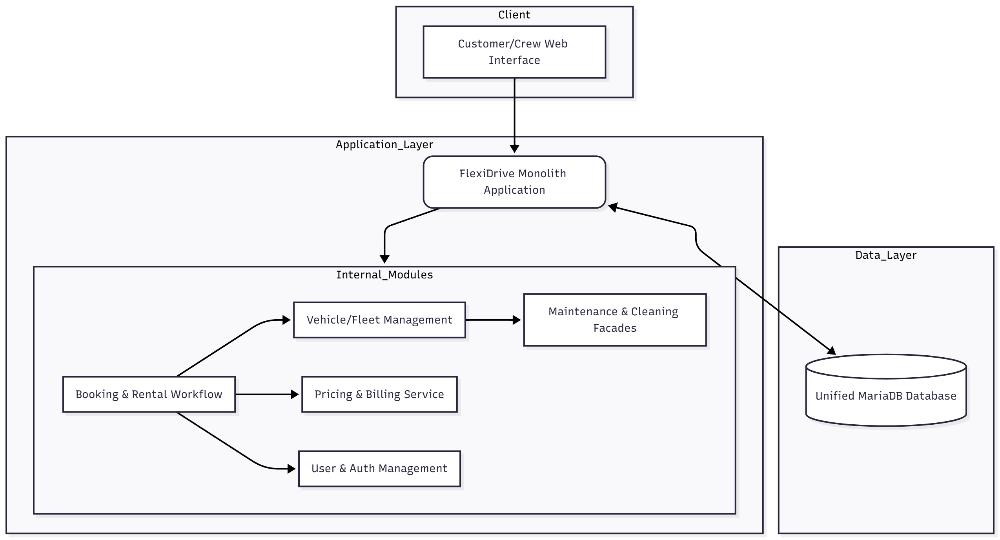
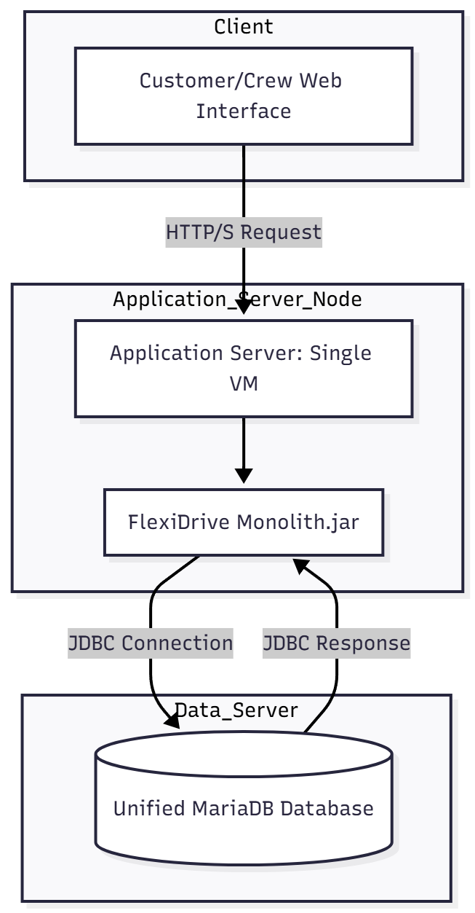
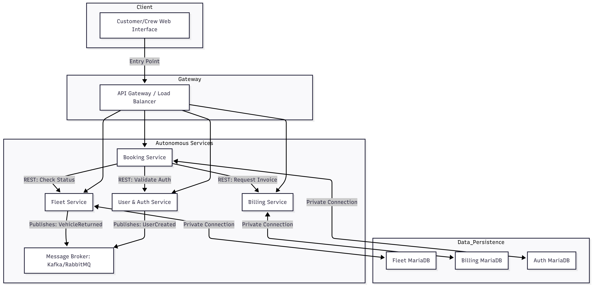
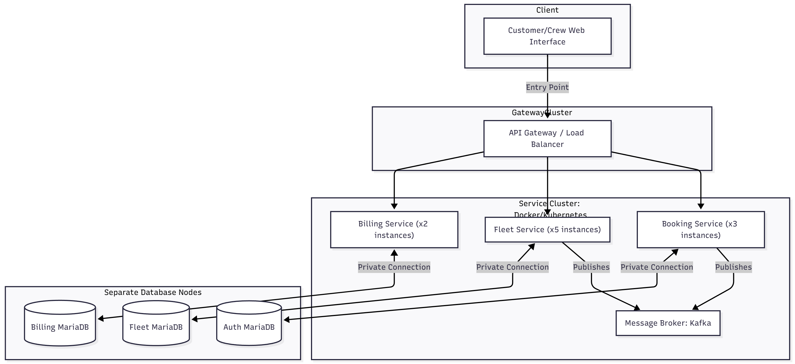
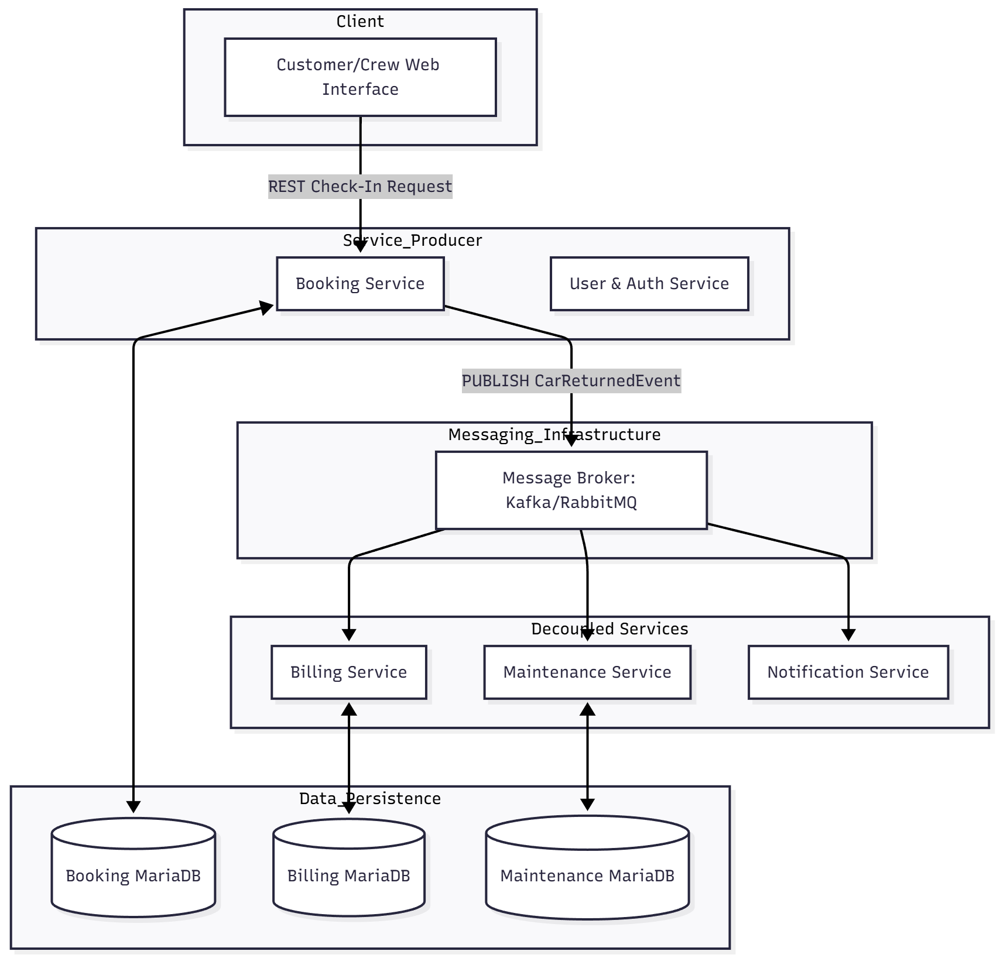
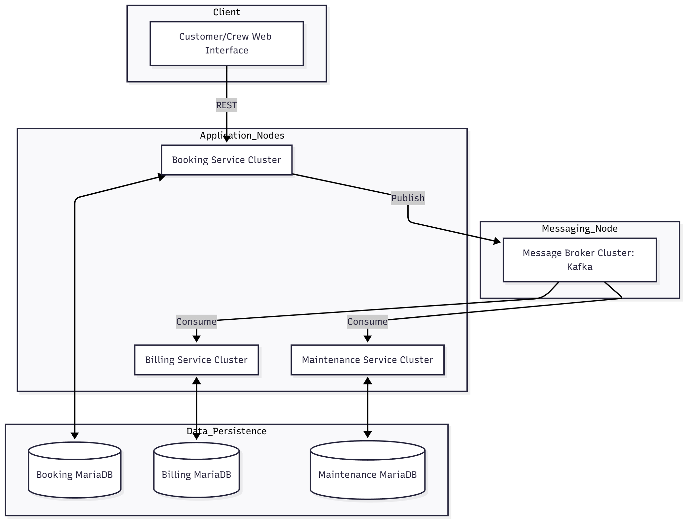

# Milestone 3: FlexiDrive Architectural Analysis

**Project:** FlexiDrive - The Dynamic Car Rental System  
**Goal:** Investigate, describe, and evaluate three different software architectures: Monolithic, Microservices, and Event-Driven Architecture (EDA), tailored to FlexiDrive's requirements (scalability, crew coordination, extensibility).

---

## 1. Monolithic Architecture

The Monolithic architecture builds the entire FlexiDrive system as a single, unified codebase running as one process (e.g., a Java Spring Boot application) and sharing a single database.

### A. Structure Description

| Component | Description & Role | Interactions & Data Flow |
| :--- | :--- | :--- |
| **Single FlexiDrive Application** | Contains all business logic: Booking, Fleet, Billing, User Management, plus patterns like Facade, Strategy, Observer. | All internal module communication happens via **in-process function calls**. |
| **Unified Database** | Single **MariaDB** instance shared by all application modules. | Stores all data (Users, Vehicles, Bookings, Invoices) in one schema, ensuring **ACID transactions** across modules. |

### B. Diagrams

#### Component Diagram

#### Deployment Diagram

### C. Pros and Cons

| Advantages | Disadvantages |
| :--- | :--- |
| **Simple Development & Testing** – End-to-end workflows are easy to debug. | **Low Scalability** – Scaling high-traffic modules requires scaling the entire monolith. |
| **Easy Transaction Management** – Strong ACID consistency across modules. | **Tight Coupling** – Changes in one module can impact others; full redeployment required. |
| **Centralized Monitoring & Logging** – Easier performance tracking and error logging. | **Limited Fault Isolation** – Failure in one module may crash the entire system. |
| **Simpler Deployment** – Single application deployment reduces operational overhead. | **Slower Time-to-Market** – Adding features requires rebuilding the full application. |

---

## 2. Microservices Architecture

Microservices decompose FlexiDrive into independent services based on business domains (Booking, Fleet, Billing, User/Auth). Each service runs independently and has a private database. Communication occurs via REST APIs and a Message Broker for asynchronous events.

### A. Structure Description

| Component | Description & Role | Interactions & Data Flow |
| :--- | :--- | :--- |
| **Autonomous Services** | Independent services for each core domain. | Communication via **REST APIs** (synchronous) and **Message Queues** (asynchronous). |
| **Private Databases** | Each service maintains its own **MariaDB instance**. | Direct database access between services is not allowed. |
| **API Gateway** | Central entry point for client requests, handling authentication and routing. | Clients communicate only with the API Gateway. |

### B. Diagrams

#### Component Diagram

#### Deployment Diagram

### C. Pros and Cons

| Advantages | Disadvantages |
| :--- | :--- |
| **High Scalability** – Services can scale independently. | **Operational Complexity** – Managing multiple services, network calls, and logs is complex. |
| **Fault Isolation** – Failure in one service does not impact others. | **Distributed Transactions** – Data consistency across services requires careful handling. |
| **Independent Deployment** – Services can be updated independently, reducing downtime. | **Inter-Service Latency** – Network calls are slower than in-process communication. |
| **Enhanced Observability** – Monitoring and logging can be tailored per service. | **DevOps Overhead** – Containerization, orchestration, and monitoring add complexity. |

---

## 3. Event-Driven Architecture (EDA)

EDA is a distributed architecture built on asynchronous communication. Services publish and consume events via a Message Broker, achieving high decoupling and fault tolerance.

### A. Structure Description

| Component | Description & Role | Interactions & Data Flow |
| :--- | :--- | :--- |
| **Event Producer** | Publishes state changes (e.g., **Booking Service** publishes `CarReturnedEvent`). | Publishes event and immediately finishes, decoupled from consumers. |
| **Message Broker** | Central channel (e.g., Kafka) for routing events. | Decouples producers from consumers and buffers events reliably. |
| **Event Consumers** | Services that react to events asynchronously (e.g., **Billing Service**, **Maintenance Service**). | Pulls events when ready, allowing horizontal scaling and fault tolerance. |

### B. Diagrams

#### Component Diagram

#### Deployment Diagram

### C. Pros and Cons

| Advantages | Disadvantages |
| :--- | :--- |
| **Extreme Decoupling** – Producers do not know which services consume events. | **Eventual Consistency** – Data across services is synchronized over time, not instantly. |
| **High Responsiveness** – Publishing an event frees the request thread immediately. | **Debugging Complexity** – Tracking a transaction across queues is harder. |
| **Built-in Fault Tolerance** – Events queue up if consumers are down, preventing data loss. | **Infrastructure Overhead** – Requires a highly available Message Broker and additional infrastructure. |

---

## 4. Final Comparison and Conclusion

### A. Comparison of Architectures

| Feature | Monolithic | Microservices | Event-Driven (EDA) |
| :--- | :--- | :--- | :--- |
| **Scalability** | Poor (Must scale all components together) | Excellent (Scale individual services independently) | Excellent (Scales services and consumption layers independently) |
| **Flexibility/Extensibility** | Low (High coupling) | Medium (Independent codebases) | High (Extreme decoupling via events) |
| **Data Consistency** | High (Immediate, ACID transactions) | Low (Requires eventual consistency) | Low (Requires eventual consistency) |
| **Fault Isolation** | Poor (Failure in one module can crash entire system) | Good (Failure in one service does not crash others) | High (Broker prevents cascade failures) |
| **Crew Coordination (Real-Time)** | Low (Synchronous updates) | Medium (REST communication) | High (Asynchronous events guarantee notifications reliably) |

### B. Final Selection and Justification

The most suitable architecture for **FlexiDrive** is **Microservices augmented with Event-Driven Communication**.

**Justification:**

1. **Scalability:** Microservices allow the high-traffic **Booking Service** to scale independently.  
2. **Reliability for Complex Workflows:** EDA ensures the **Car Return/Check-In** process updates Billing, Maintenance, and Crew notifications reliably and decoupled.  
3. **Technological Flexibility:** Combines synchronous REST for immediate actions and asynchronous events for backend processes, optimizing speed and reliability.
